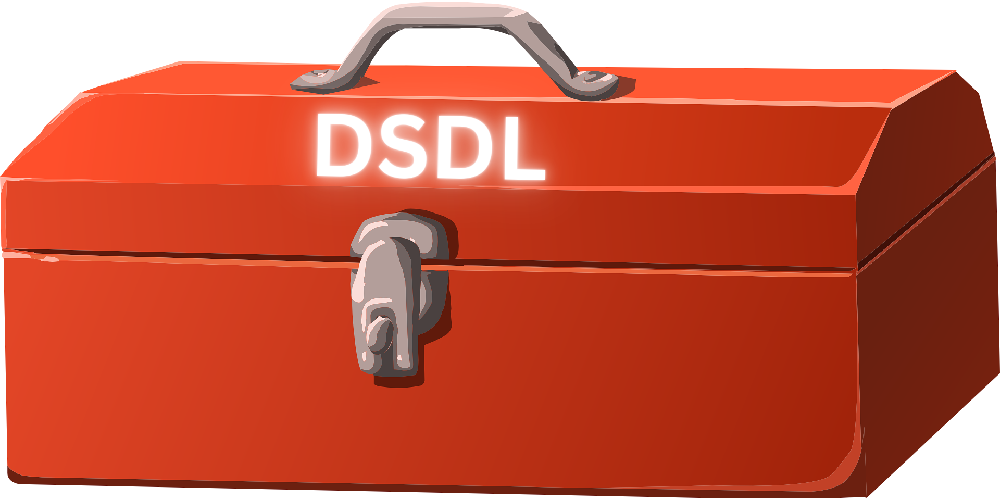

# DSDL toolbox


### About

This repository tries to streamline DSDL generation to create set of C/C++ files which can be used in your baremetal/FreeRTOS/Zephyr etc. applications. 

DroneCAN and UAVCAN are great protocols for use on UAV platforms, but it might be quite complex to generate DSDL files from scratch. 

Current workflow is based on:
https://github.com/dronecan/dronecan_dsdlc
which has many steps and hidden commands. 


This script makes process slightly faster.


### How to use it


1.  create folder (for example called "custom") in root directory of this repository. In that folder create a DSDL structure.
```rst
custom\uavcan\equipment\custom_ahrs\my_custom_ahrs.uavcan
```
2. Execute script:
```shell
python .\generator.py -I custom -O generated_files
```
or, if you want to generate DSDL repository with your custom files:
```shell
python .\generator.py -I custom -O generated_files --export-dsdl
```
Second command is usefull if you want to contribute to DSDL project with your custom definitions

3. Enjoy your standard & custom C/C++. You can paste **generated_files** folder directly to your C/C++ project. 


